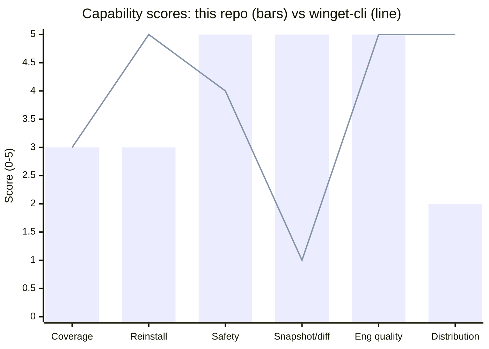

# Installed Software Inventory

[](https://github.com/Kozphy/installed-software-inventory/actions/workflows/ci.yml)

Safe, local-first command-line tool that scans a Windows computer for installed software and exports the results to **table**, **JSON**, **CSV**, or **winget import** formats. Version **1.3** adds a read-only **Appx / MSIX collector**, so Microsoft Store apps appear next to Registry apps, each row tagged with its `source`. It builds on the v1.2 winget reinstall bridge and the v1.1 snapshot/diff workflow.

## Purpose

This project reads traditional Windows **Uninstall** Registry keys and the current user's **Appx / MSIX package catalog** (Microsoft Store and packaged apps) to build an inventory of installed applications. It is designed for personal audits, asset tracking, and documentation—without network access, without administrator rights for normal use, and without modifying the system.

## Safety and privacy

- **Read-only**: the tool never writes Registry values, never adds or removes packages, and never runs uninstall commands.
- **Appx enumeration** runs a fixed, enumeration-only Windows PowerShell 5.1 script (`PackageManager.FindPackagesForUser`) passed via `-EncodedCommand`; it takes no user input.
- **Local-first**: all data stays on your machine; the tool makes **no network requests**.
- **No Win32_Product**: the WMI `Win32_Product` class is intentionally avoided because querying it can trigger Windows Installer repair or consistency checks.
- **No elevation required** for normal scans of readable Uninstall keys (some protected keys may simply be skipped).
- **Scan metadata** in JSON reports includes hostname, platform string, timestamps, and filter counts. It does **not** include Windows usernames, email addresses, or other account identifiers. Hostname is included so fleet snapshots can be distinguished; omit or redact it downstream if that is too identifying for your use case.

## Requirements

| Requirement | Details |
|-------------|---------|
| Operating system | Windows 10/11 (or Windows Server with standard Uninstall keys) |
| Python | 3.10 or newer |
| Privileges | Standard user is sufficient for normal use |
| Extra packages | None required for runtime (stdlib only) |

## Installation

```powershell
cd installed-software-inventory
python -m venv .venv
.\.venv\Scripts\Activate.ps1
python -m pip install -e ".[dev]"
```

If you prefer not to install, set `PYTHONPATH` to the `src` folder:

```powershell
$env:PYTHONPATH = "$PWD\src"
python -m software_inventory --help
```

## CLI examples

```powershell
python -m software_inventory
python -m software_inventory --format table
python -m software_inventory --format json
python -m software_inventory --format json --pretty --output reports/software.json
python -m software_inventory --format json --legacy-json --output reports/legacy.json
python -m software_inventory --format csv --output reports/software.csv
python -m software_inventory --format winget --output reports/winget-packages.json
python -m software_inventory --format winget --include-versions --output reports/winget-packages.json
python -m software_inventory --search microsoft
python -m software_inventory --source appx
python -m software_inventory --source registry --format csv --output reports/registry-only.csv
python -m software_inventory --include-system-components
python -m software_inventory --include-updates
python -m software_inventory --format json --pretty --verbose
python -m software_inventory --from-json reports/latest.json --format csv --output reports/latest.csv
```

### Snapshot comparison

```powershell
python -m software_inventory diff reports/old.json reports/new.json
python -m software_inventory diff reports/old.json reports/new.json --format table
python -m software_inventory diff reports/old.json reports/new.json --format json
python -m software_inventory diff reports/old.json reports/new.json --format json --pretty --output reports/diff.json
```

### Scan arguments

| Argument | Description |
|----------|-------------|
| `--format table\|json\|csv\|winget` | Output format (default: `table`) |
| `--output PATH` | Write to a file instead of stdout (creates parent dirs) |
| `--source all\|registry\|appx` | Collectors to run (default: `all`); with `--from-json`, filters rows by source |
| `--search TEXT` | Case-insensitive match on name, publisher, or version |
| `--include-system-components` | Show entries marked `SystemComponent` |
| `--include-updates` | Show Windows updates / hotfixes |
| `--pretty` | Indent JSON output |
| `--legacy-json` | Emit a top-level JSON array (v1.0 shape) instead of the report envelope |
| `--from-json PATH` | Replay a JSON snapshot instead of scanning the machine |
| `--winget-list PATH` | Offline winget package fixture (skips live `winget list`) |
| `--include-versions` | Pin versions in `--format winget` import JSON |
| `--unmatched-output PATH` | Markdown checklist for apps with no winget Id |
| `--verbose` | Detailed diagnostics on stderr |
| `--version` | Print package version |

### Default filters

1. Entries without a valid display name are dropped.
2. System components are hidden unless `--include-system-components` is set.
3. Updates and hotfixes are hidden unless `--include-updates` is set.
4. Duplicate records from overlapping Registry views are merged (richest metadata wins).
5. An Appx row is dropped when a Registry row has the same name and a compatible publisher (the Registry row keeps uninstall strings and size).
6. Appx resource packages are skipped; frameworks and OS-signed packages count as system components.
7. Results are sorted alphabetically by application name.

### Exit codes

| Code | Meaning |
|------|---------|
| `0` | Success |
| `1` | Runtime / I/O / invalid snapshot input |
| `2` | Usage error (argparse) |
| `3` | Unsupported platform (non-Windows for scans) |

`diff` and `--from-json` work on any platform that can read the JSON files; live scanning requires Windows. If the Appx collector fails during `--source all` (for example, Windows PowerShell is unavailable), the scan logs a warning and continues with Registry rows.

## CLI harness

The process harness runs the real CLI as a subprocess against fixture snapshots. It does **not** scan the live Registry or Appx catalog (`SOFTWARE_INVENTORY_SKIP_LIVE_SCAN=1`).

```powershell
python scripts/run_cli_harness.py
python scripts/run_cli_harness.py --keep-transcripts harness-output
python -m pytest tests/test_cli_harness.py -q
```

It checks help/version, usage and runtime exit codes, table/JSON/CSV/winget export, `--legacy-json`, UTF-8 names, snapshot `diff`, `--source` filtering and the Appx-to-Registry merge, and that live Registry and Appx scans are blocked when the skip flag is set.

## JSON schema (v1.2)

Default JSON output is a **versioned report envelope**:

```json
{
  "schema_version": "1.2",
  "scan": {
    "started_at": "2026-07-17T06:00:00Z",
    "completed_at": "2026-07-17T06:00:01Z",
    "duration_ms": 1000,
    "hostname": "WORKSTATION-01",
    "platform": "Windows-10-10.0.26200-SP0",
    "collector_sources": [
      "HKEY_LOCAL_MACHINE\\SOFTWARE\\Microsoft\\Windows\\CurrentVersion\\Uninstall [64-bit view]",
      "Appx/MSIX packages [Windows.Management.Deployment.PackageManager, current user]"
    ],
    "raw_entry_count": 100,
    "deduplicated_count": 5,
    "filtered_system_component_count": 10,
    "filtered_update_count": 8,
    "result_count": 77
  },
  "software": [
    {
      "name": "Example Editor",
      "version": "1.2.3",
      "publisher": "Example Inc",
      "install_date": "2026-07-17",
      "install_location": "C:\\Program Files\\Example Editor",
      "estimated_size_kb": 870400,
      "scope": "machine",
      "architecture": "64-bit",
      "uninstall_string": "C:\\Program Files\\Example Editor\\uninstall.exe",
      "quiet_uninstall_string": "C:\\Program Files\\Example Editor\\uninstall.exe /S",
      "registry_path": "HKEY_LOCAL_MACHINE\\SOFTWARE\\Microsoft\\Windows\\CurrentVersion\\Uninstall\\ExampleEditor",
      "release_type": null,
      "system_component": false,
      "source": "registry"
    }
  ]
}
```

Timestamps are UTC ISO-8601 with a `Z` suffix. v1.2 adds the per-row `source` field (`registry` or `appx`); everything else keeps the v1.1 semantics. Appx rows use `registry_path` = `appx:<PackageFamilyName>`, `scope` = `current_user`, and never carry uninstall strings. CSV appends a `source` column at the end, and the table gains a `Source` column. v1.1 envelopes still load, with `source` defaulting to `registry`.

### Migration from v1.0 JSON arrays

Consumers that expect a **top-level array** should either:

1. Pass `--legacy-json` when exporting, or
2. Read `payload["software"]` when `schema_version` is present.

Both shapes are accepted as input to `diff`.

## Winget reinstall bridge

`--format winget` keeps this tool as the safe Uninstall census and adds a
reinstall companion:

1. Load inventory (live Registry + Appx scan, or `--from-json`).
2. Load winget packages (`winget list`, or `--winget-list` fixture offline).
3. Match display names to importable `PackageIdentifier` values (Source
   `winget` / `msstore`; ARP\\ and MSIX\\ synthetic IDs are skipped).
4. Write packages.schema.2.0 JSON for `winget import`.
5. Write a Markdown checklist of unmatched apps for manual reinstall.

```powershell
# Live machine: scan + winget list
python -m software_inventory --format winget --output reports/winget-packages.json
# → reports/winget-packages.json
# → reports/winget-packages.unmatched.md

# After OS wipe, restore catalog apps:
winget import -i reports\winget-packages.json

# Offline / CI (fixture winget list + snapshot)
python -m software_inventory `
  --from-json reports/latest.json `
  --format winget `
  --winget-list tests/fixtures/cli/winget-list.json `
  --output reports/winget-packages.json
```

The bridge never runs `winget import` itself and never uninstalls software.

## Snapshot workflow

Recommended automation loop:

1. Export a JSON snapshot (envelope).
2. Keep `reports/latest.json` as the last known good scan.
3. On the next run, compare previous vs new with `diff`.
4. Archive timestamped JSON/CSV/diff files.

`scripts/run_inventory.ps1` implements this workflow:

```powershell
.\scripts\run_inventory.ps1
```

It writes:

```text
reports/installed-software-YYYY-MM-DD-HHMMSS.json
reports/installed-software-YYYY-MM-DD-HHMMSS.csv
reports/winget-packages-YYYY-MM-DD-HHMMSS.json
reports/winget-packages-YYYY-MM-DD-HHMMSS.unmatched.md
reports/latest.json
reports/previous.json                 # copy of prior latest, when present
reports/installed-software-diff-YYYY-MM-DD-HHMMSS.json
```

The script does **not** change the PowerShell execution policy. If scripts are blocked:

```powershell
powershell -NoProfile -ExecutionPolicy Bypass -File .\scripts\run_inventory.ps1
```

## Example diff output

```text
Inventory Diff Summary
======================
Added:      1
Removed:    1
Changed:    1
Unchanged:  40

Added
-----
  + New Tool (1.0.0) — Vendor Inc

Removed
-------
  - Old Tool (2.1) — Vendor Inc

Changed
-------
  ~ Example Editor: 1.2.3 → 1.3.0
      version: '1.2.3' → '1.3.0'
```

Diff identity uses normalized **name + publisher + install location** (version excluded so upgrades appear as changes). Appx rows use **package family + architecture** instead, because their install folder contains the version.

## Collected fields

| Field | Description |
|-------|-------------|
| `name` | Application display name (`DisplayName`) |
| `version` | Display version string |
| `publisher` | Publisher / vendor |
| `install_date` | Normalized `YYYY-MM-DD`, or `null` if unknown/invalid |
| `install_location` | Install folder when present |
| `estimated_size_kb` | Registry `EstimatedSize` in KB (original units preserved) |
| `scope` | `machine` (HKLM) or `current_user` (HKCU) |
| `architecture` | `64-bit`, `32-bit`, or `unknown` based on Registry view |
| `uninstall_string` | Uninstall command (reported only; never executed) |
| `quiet_uninstall_string` | Quiet uninstall command when present |
| `registry_path` | Full path of the Uninstall subkey, or `appx:<PackageFamilyName>` for packages |
| `release_type` | Registry `ReleaseType` when present |
| `system_component` | Whether `SystemComponent` is set (or the package is a framework / OS-signed) |
| `source` | Collector that produced the row: `registry` or `appx` |

## Collector sources

- `HKEY_LOCAL_MACHINE\SOFTWARE\Microsoft\Windows\CurrentVersion\Uninstall`
- `HKEY_LOCAL_MACHINE\SOFTWARE\WOW6432Node\Microsoft\Windows\CurrentVersion\Uninstall`
- `HKEY_CURRENT_USER\SOFTWARE\Microsoft\Windows\CurrentVersion\Uninstall`

Both 32-bit and 64-bit Registry views are used where applicable.

The Appx collector enumerates the current user's packages with
`Windows.Management.Deployment.PackageManager.FindPackagesForUser("")` through
Windows PowerShell 5.1 (WinRT projection is not available in PowerShell 7).

## Coverage limitations

Uninstall keys plus the Appx catalog still do **not** capture every program on a PC:

- Appx packages installed only for **other users** (the collector reads the current user's catalog)
- **Portable** programs that never register an Uninstall key
- Software installed only through **custom package managers**
- Entries with empty `DisplayName` (filtered out by design)
- Values the current user cannot read (skipped quietly)

## Troubleshooting

| Problem | What to try |
|---------|-------------|
| `only runs on Windows` | Live scans require Windows; `diff` works on saved JSON anywhere. |
| `Python was not found` | Install Python 3.10+ and ensure `python` is on `PATH`. |
| `unsupported schema_version` | Use a v1.1/v1.2 envelope or a legacy array; upgrade the tool if needed. |
| Empty or sparse results | Try `--include-system-components` / `--include-updates`. |
| `Appx/MSIX packages skipped` warning | Windows PowerShell 5.1 is missing or blocked by policy; Registry rows are still exported. Run `--source appx --verbose` to see the error. |
| `winget was not found` | Install App Installer, or pass `--winget-list` with a fixture. |
| Garbled console text | Prefer `--output` files (UTF-8); some consoles use legacy code pages. |
| Module not found | Install with `pip install -e .` or set `PYTHONPATH` to `src`. |

## Example CSV output

```csv
name,version,publisher,install_date,install_location,estimated_size_kb,scope,architecture,uninstall_string,quiet_uninstall_string,registry_path,release_type,system_component,source
Example Editor,1.2.3,Example Inc,2026-07-17,C:\Program Files\Example Editor,870400,machine,64-bit,C:\Program Files\Example Editor\uninstall.exe,C:\Program Files\Example Editor\uninstall.exe /S,HKEY_LOCAL_MACHINE\SOFTWARE\Microsoft\Windows\CurrentVersion\Uninstall\ExampleEditor,,False,registry
```

## Roadmap and competitive review

An interactive architecture and competitive review lives in
[`docs/upgrade-review.canvas.tsx`](docs/upgrade-review.canvas.tsx). It is a
[Cursor Canvas](https://cursor.com): open the file in Cursor to see the charts
and tables. GitHub shows it as source only, so the key points are summarized
here.

### Capability scores (0–5, higher is better)



Bars are this repo (v1.3); the line is winget-cli. The table below compares
all four tools.

| Capability | This repo (v1.3) | winget-cli | AppList | swinv |
|------------|:----------------:|:----------:|:-------:|:-----:|
| Coverage | 3 | 3 | 5 | 5 |
| Reinstall | 3 | 5 | 5 | 1 |
| Safety (read-only) | 5 | 4 | 3 | 4 |
| Snapshot / diff | 5 | 1 | 3 | 2 |
| Engineering quality | 5 | 5 | 3 | 4 |
| Distribution | 2 | 5 | 2 | 2 |

Scores come from a local code review plus public READMEs (September 2026).

### Similar projects

| Project | Focus | Reinstall support | Writes to the system |
|---------|-------|-------------------|----------------------|
| This repo | Safe Uninstall-key + Appx audit, snapshots, diffs | winget import JSON + unmatched checklist | Never |
| [microsoft/winget-cli](https://github.com/microsoft/winget-cli) | Official package manager | `winget export` / `winget import` | Installs and upgrades |
| [SysAdminDoc/AppList](https://github.com/SysAdminDoc/AppList) | Migration and rebuild planning | winget JSON, install script, bundle | Optional removal scripts (dry-run default) |
| [chaugan/swinv](https://github.com/chaugan/swinv) | Deep local discovery (Registry, Appx, filesystem) | Inventory only | Read-only by default |
| NirSoft UninstallView | Interactive uninstall and cleanup | Not a goal | Can uninstall |

### What this repo already does well

- **Safety contract:** read-only Registry access, enumeration-only Appx
  queries, no network for scans, no `Win32_Product`, and
  `SOFTWARE_INVENTORY_SKIP_LIVE_SCAN` enforced in both collectors and CI. The
  winget bridge only reads `winget list`; it never runs `winget import`.
- **Snapshot and diff design:** the deduplication key includes version, so
  co-installed versions stay separate rows. The diff identity excludes version,
  so upgrades show up as Changed instead of remove plus add.
- **Testability:** 102 unit tests and 18 CLI process harness cases run against
  fixtures. `--from-json` and `--winget-list` work offline, and CI covers
  Python 3.10–3.13 on Windows.
- **Reinstall workflow:** a winget import JSON for catalog apps, plus a
  Markdown checklist for everything winget cannot match.

### Architecture and remaining gaps

| Layer | Today | Gap to close |
|-------|-------|--------------|
| Collector | `windows_registry` + `windows_appx` (current user) | No formal collector protocol; no other package managers (Chocolatey, Scoop) |
| Normalize | Dedupe key includes version; per-row `source` tags; Appx-to-Registry merge by name + publisher | A blank `install_location` weakens Registry identity |
| Report | v1.2 envelope with privacy-aware scan metadata | No checked-in JSON Schema file validated in CI |
| Diff | Registry: name + publisher + install location; Appx: package family + architecture | A Registry publisher rename or path move shows as remove + add |
| Export | table / JSON / CSV / winget import + unmatched checklist | Winget matching uses display names only; no HTML summary |
| Ops | PowerShell runner: JSON/CSV, latest/previous, auto-diff, winget pair | No Task Scheduler template; no PyPI release yet |

### Roadmap

| ID | Item | Status |
|----|------|--------|
| P0 | Winget reinstall bridge (`--format winget`) | Done in v1.2.0 |
| P1 | Read-only Appx / MSIX collector so Store apps appear | Done in v1.3.0 |
| P2 | Collector protocol, JSON Schema file checked in CI (per-row source tags shipped in v1.3.0) | Next |
| P3 | Stronger diff identity and publisher-aware winget matching | Planned |
| P4 | PyPI release and better discoverability | Planned |

Non-goals: querying `Win32_Product`, silent uninstall or automatic
`winget import`, and full-filesystem scanning.

## Project layout

```text
installed-software-inventory/
├── README.md
├── CHANGELOG.md
├── LICENSE
├── pyproject.toml
├── .gitignore
├── .github/workflows/ci.yml
├── docs/
│   └── upgrade-review.canvas.tsx
├── scripts/
│   ├── run_inventory.ps1
│   └── run_cli_harness.py
├── src/
│   └── software_inventory/
│       ├── __init__.py
│       ├── __main__.py
│       ├── cli.py
│       ├── models.py
│       ├── normalize.py
│       ├── exporters.py
│       ├── report.py
│       ├── diff.py
│       ├── winget_bridge.py
│       └── collectors/
│           ├── __init__.py
│           ├── windows_registry.py
│           └── windows_appx.py
└── tests/
    ├── fixtures/cli/
    ├── test_normalize.py
    ├── test_deduplication.py
    ├── test_exporters.py
    ├── test_registry_parsing.py
    ├── test_report.py
    ├── test_diff.py
    ├── test_winget_bridge.py
    ├── test_appx_collector.py
    └── test_cli_harness.py
```

## License

MIT — see [LICENSE](LICENSE).
